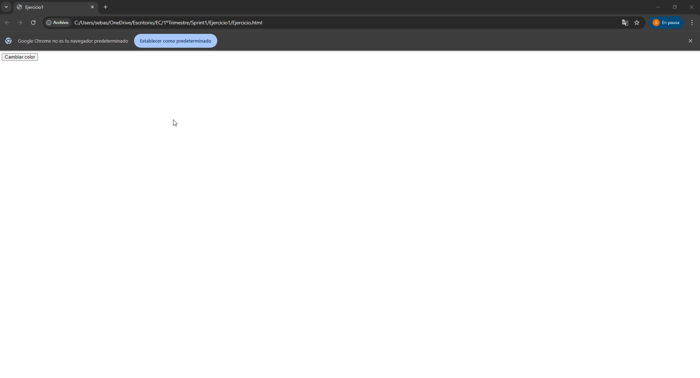
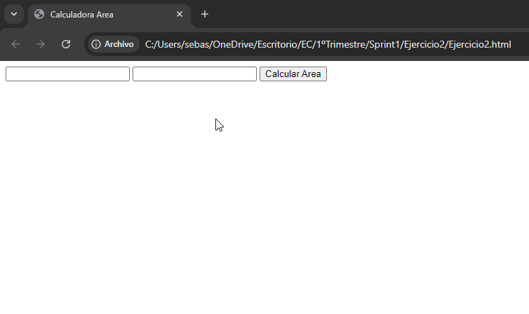
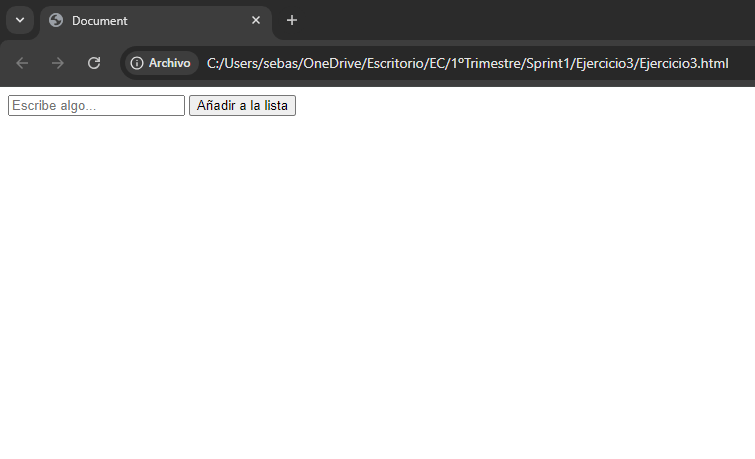
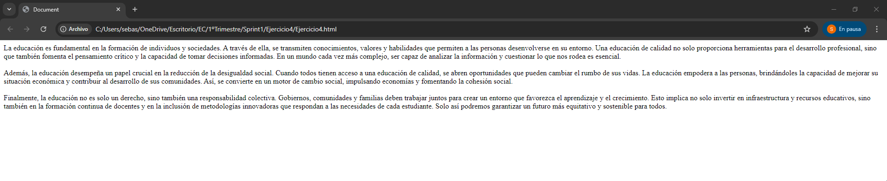

# EC

# Ejercicio 1: Cambio de Color con Botón

## Análisis del Problema
El objetivo del ejercicio es crear una página web que contenga un botón  etiquetado `Cabiar color`que permita cambiar el color de fondo de la página cada vez que se haga clic el color de fondo de la página debe cambiar a un color aleatorio.. El cambio de color debe ser aleatorio, lo que implica el uso de una función que genere colores RGB al azar.Como pista  utiliza `Math.random()` para generar valores RGB aleatorios. Se entregarán dos archivos:

- **ejercicio1.html**: Estructura de la página web.
- **ejercicio1.js**: Funcionalidad de la página para generar colores aleatorios.

## Diseño de la Propuesta de Solución
Para resolver el problema del primer ejercicio he tenido que hacer estos pasos:

1. **HTML (ejercicio1.html)**: En el html he tenido que crear previamente llamado `ejercicio.html` , he comenzado con la etructura básica utilizando el atajo html:5 donde dentro del body he puesto script donde dentro de el he puesto un src para enlazarlo con el archivo .js , el codigo cual ha quedado asi :**\<script src="Ejercicio1.js"></script>**. Después arriba de la etiqueta script he creado un botón el cual le he añadido un id llamado `btnColor`.

###

2. **JavaScript (ejercicio1.js)**: En este archivo . js Primero deberia saber como enlazar un boton con un id en html al archivo js primero intenté buscarlo a travé de google pero no lo supe identificar  **https://www.tutorialspoint.com/how-to-use-an-html-button-to-call-a-javascript-function** entonces decidí preguntarle a chat gpt con esta pregunta **como enlazar un boton con un id en un archivo html a un archivo js explicando cada paso detallado** Después de ello me explicaron como hacer que identifique el cili que seria con el **.addEventListener('click', () =>{}..)** donde tambien lo hice con arrows que lo dimos el día de ayer con Gabriel, dsp dentro del arrow tuve que decirle que el fondo sea random lo que hice es enlazar el background del html con la funcion de generar un color aleatorio **RGB**, Por ultimo pedi al chat gpt como generar colores aleatorios, primero me lo dio en hexadecimal pero no entendí la logica aunque funcionaba bien así que le pedí que me lo diera en RGB preguntandole esto:

###

- **Pregunta 1:**. he creado en html un boton el cual en js lo que tiene que hacer es cambiar el color del body cuando presiono dicho color como se haria utilizando el mathrandom

###

- **Pregunta 2:**. hazme este codigo pero en vez de hexadecimal hazlo con colores rgb

###

- **Pregunta 3:**. 

    //Esta es la funcion de random
    const generarAleatorio = () => {

    // Esta es una cadena de texto que contiene todos los caracteres posibles para un color hexadecimal. 
    const colores = '0123456789ABCDEF';
    //Inicializa una variable llamada color y la # para que el navegador reconozca el color hexadecimal
    let color = '#';
    //Este bucle inicializas i = 0 y que se ejecute 6 veces porque los colores hexadecimales tiene 6 caracteres 
    for (let i = 0; i < 6; i++) {

        //Y es por 16 porque cada dígito hexadecimal puede tener 16 posibles valores diferentes como se ve en la contante inizializada 
        color += colores[Math.floor(Math.random() * 16)];
    }
    return color;}

    //Esto selecciona el DOM por el id , el addEventListener es para el evento de click
    document.getElementById('btnColor').addEventListener('click', () => {

    //Esto significa que del documento el body tenga un estilo de fondo random
    document.body.style.backgroundColor = generarAleatorio();});

### Diagrama de Flujo
A continuación, se muestra un diagrama de flujo simple que explica el proceso del evento:

```plaintext
   +------------------------+
   |      Página cargada    |
   +------------------------+
             |
             v
   +------------------------+
   | Usuario pulsa botón    |
   | "Cambiar color"        |
   +------------------------+
             |
             v
   +------------------------+
   |  Generar color         |
   |  aleatorio             |
   +------------------------+
             |
             v
   +------------------------+
   |  Aplicar color de      |
   |  fondo a la página     |
   +------------------------+
             |
             v
   +------------------------+
   |     Esperar nuevo      |
   |       clic             |
   +------------------------+
```

   




# Ejercicio 2:  Calculadora de Área

## Análisis del Problema

El objetivo del ejercicio es crear una página web que  sea capaz de calcular el area fe un rectangulo a partir de la entrada de dos inputs para el ancho y el alto de un rectangulo, un botón etiquetado `Calcular Área` que al hacer click en el botón calcula el area y muestra el resultado en un elemento `<p>` en la página.Se entregarán dos archivos:

- **ejercicio1.html**: Estructura de la página web.
- **ejercicio1.js**: Funcionalidad de la página para generar el Área.

## Diseño de la Propuesta de Solución

Para resolver el problema del primer ejercicio he tenido que hacer estos pasos:

1. **HTML (ejercicio2.html)**: En el html he tenido que crear previamente llamado `ejercicio2.html` , he comenzado con la etructura básica utilizando el atajo html:5 donde dentro del body he puesto script donde dentro de el he puesto un src para enlazarlo con el archivo .js , el codigo cual ha quedado asi :**\<script src="Ejercicio2.js"></script>**. Después arriba de la etiqueta script he creado dos inputs del tipo texto los cuales tienen cada uno una id propia para cerciorarme de como se hacía el input miré en: https://developer.mozilla.org/es/docs/Web/HTML/Element/input ,después cree un boton con un id llamado `btnArea` y por ultimo un `<p>` con un id llamado `resultado`.

###

2. **JavaScript (ejercicio2.js)**: En este archivo .js lo primero que hice fue hacer la estructura basica de este, es decir, cree la constante generar area con la funcion arrow y la estructura de como enlazar un boton con un id en un archivo html a un archivo js , también que identifique el click en el botón eso lo saqué del `ejercicio 1` ,después pase a la función de generar área primero sabía que tenía que inicializar ahí los valores de ancho y alto , tambien inicializar `area = ancho*alto` pero no sabia como hacer que se inicializaran los valores así que pregunté a chat gpt , después pase a la otra estructura consegí hacerlo pero el resultado me daba undefined y esque no había puesto el id al `<p>` por lo que le pregunté esto a chat gpt :

- **Pregunta 1:** tengo este codigo y un archivo html donde tengo dos inputs uno llamado por un id ancho y el otro alto quiero que en esta funcion coja los valores que escriba y multiplique los dos valores const generarArea = () => {
}

- **Pregunta 2:** tego este codigo pero al darle al boton me dice que el resultado es undefined 

document.getElementById('btnArea').addEventListener('click',  () => {
const area = generarArea();
document.getElementById('resultado').innerText = `El área es: ${area}`; });

### Diagrama de Flujo
A continuación, se muestra un diagrama de flujo simple que explica el proceso del evento:

```plaintext
+---------------------------+
|      Página cargada       |
+---------------------------+
             |
             v
 +---------------------------+
| Usuario ingresa ancho y    |
| alto del rectángulo        |
+----------------------------+
             |
             v
+---------------------------+
|  Usuario pulsa botón      |
|  "Calcular Área"          |
+---------------------------+
             |
             v
+---------------------------+
|  Obtener valores de ancho |
|  y alto                   |
+---------------------------+
             |
             v
+---------------------------+
|  Calcular área: ancho x   |
|  alto                     |
+---------------------------+
             |
             v
+---------------------------+
|  Mostrar el resultado en  |
|  el elemento <p>          |
+---------------------------+
             |
             v
+---------------------------+
|  Esperar nuevo cálculo    |
+---------------------------+
```



# Ejercicio 3:  Listado Dinámico

## Análisis del Problema

El objetivo del ejercicio es crear una página web que  sea capaz de que cuando el usuario escribe algo en el campo de entrada y hace clic en el botón, entonces el contenido del campo debe agregarse como un nuevo ítem `<li>` a la lista. A partir de la entrada de un input para poner un campo de texto,una lista vacia `ul` o `òl` en mi caso utilicé ul y un botón etiquetado `Añadir a la lista` que al hacer click en el botón añadir a la lista, muestra esa palabra que has escrito en un elemento `li` nuevo . Pista: Utiliza el método `.createElement()` y `.appendChild()` del DOM. Se entregarán dos archivos:

- **ejercicio1.html**: Estructura de la página web.
- **ejercicio1.js**: Funcionalidad de la página para mostrar la palabra del campo de entrada.

## Diseño de la Propuesta de Solución

Para resolver el problema del primer ejercicio he tenido que hacer estos pasos:

1. **HTML (ejercicio3.html)**: En el html he tenido que crear previamente llamado `ejercicio2.html` , he comenzado con la etructura básica utilizando el atajo html:5 donde dentro del body he puesto script donde dentro de el he puesto un src para enlazarlo con el archivo .js , el codigo cual ha quedado asi :**\<script src="Ejercicio2.js"></script>**. Después arriba de la etiqueta script he creado un input del tipo texto el cual ya sabía hacerlo del ejercicio anterior,después cree un boton con un id llamado `btnLista` y por ultimo un `<ul>` vacio con un id llamado `lista`.

###

2. **JavaScript (ejercicio2.js)**: En este archivo .js lo primero que hice fue que enlazara el boton y después que identificara cuando hiciera el click, con la formula de arrow despues inicialicé dos valores que serian el input y el texto pero no sabía que poner asi que tuve que preguntar a chatgpt: 

- **Pregunta 1:** Quiero que hagas que cuando el usuario escribe algo en el campo de entrada y hace clic en el botón, entonces el contenido del campo debe agregarse como un nuevo ítem (`<li>`) a la lista.Pista: Utiliza el método `.createElement()` y `.appendChild()` del DOM.

###

- **Pregunta 2:** Cuando el usuario escribe algo en el campo de entrada y hace clic en el botón, entonces el contenido del campo debe agregarse como un nuevo ítem (<li>) a la lista.Pista: Utiliza el método .createElement() y .appendChild() del DOM.
este es mi html : AQUI DEBERIA VENIR EL CODIGO DEL HTML 


y este es my js 
 
 
    document.getElementById('btnLista').addEventListener('click',() =>{
    let input = document.getElementById('itemInput'); cuando le pongo algo y le doy al boton no se pone en la lista del html y no se limpia 
    let texto = input.value;

    if (texto) {
        let nuevoItem = document.createElement('li');
        nuevoItem.textContent = texto;

        let lista = document.getElementById('lista');
        lista.appendChild(nuevoItem);

        input.value = '';
    } });

### Diagrama de Flujo
A continuación, se muestra un diagrama de flujo simple que explica el proceso del evento:

```plaintext
+---------------------------+
|      Página cargada       |
+---------------------------+
             |
             v
+----------------------------+
| Usuario ingresa texto en   |
| el campo de entrada        |
+----------------------------+
             |
             v
+---------------------------+
|  Usuario pulsa botón      |
|  "Añadir a la lista"      |
+---------------------------+
             |
             v
+---------------------------+
|  Verificar si el campo    |
|  está vacío               |
+---------------------------+
             |
         +---+---+
         |       |
         |  No   | 
         |       |
         v       |
+---------------------------+
|  Añadir ítem a la lista   |
|  como nuevo <li>          |
+---------------------------+
             |
             v
+---------------------------+
|  Actualizar la lista en   |
|  la página                |
+---------------------------+
             |
             v
+---------------------------+
|  Esperar nuevo ingreso    |
+---------------------------+
```



# Ejercicio 4:  Hover y Estilo Dinámico

## Análisis del Problema

El objetivo del ejercicio es crear una página web que  sea capaz de que cuando el usuario ponga el cursor encima de los divs escritos cambie de color el fondo a azul y el texto blanco. Esto se hará a partir de generar unos div cada uno un texto diferente,Pista: Considera usar eventos como `mouseover` y `mouseout`. Se entregarán dos archivos:

- **ejercicio1.html**: Estructura de la página web.
- **ejercicio1.js**: Funcionalidad de la página ara cambiar el color del fondo y elcolor de las palabras

## Diseño de la Propuesta de Solución

1. **HTML (ejercicio3.html)**: En el html he tenido que crear previamente llamado `ejercicio2.html` , he comenzado con la etructura básica utilizando el atajo html:5 donde dentro del body he puesto script donde dentro de el he puesto un src para enlazarlo con el archivo .js , el codigo cual ha quedado asi :**\<script src="Ejercicio2.js"></script>**. Después arriba de la etiqueta script he creado tres div en los cuales pedí achat gpet que me generara tres parrafos: 

- **Pregunta 1:**  hazme tres parrafos

2. **JavaScript (ejercicio2.js)**: En este archivo .js lo primero que hice fue inicializar una constante llamada divs que seria igual a `querySelectorAll` esto se lo pregunte a chat gpt con la pregunta de abajo, después hice dos funciones una que fue para poder cambiar los colores llamada `cambiarColorPasar` y otra llamada `restaurarColor`que tendrian entre parentesis la etiqueta que quiero cambiar y viendo ejercicios anteriores los pude hacer después de varios intento por ultimo hice un div.foEach pero no lo sabía hacer asi que tuve que preguntar a chatgpt: 

- **Pregunta 1:** que necesito para seleccionar un div entero en js 

- **Pregunta 2:** con este html <!DOCTYPE html>
<html lang="en">
<head>
    <meta charset="UTF-8">
    <meta name="viewport" content="width=device-width, initial-scale=1.0">
    <title>Document</title>
</head>
<body>
    <div>La educación es fundamental en la formación de individuos y sociedades. A través de ella, se transmiten conocimientos, valores y habilidades que permiten a las personas desenvolverse en su entorno. Una educación de calidad no solo proporciona herramientas para el desarrollo profesional, sino que también fomenta el pensamiento crítico y la capacidad de tomar decisiones informadas. En un mundo cada vez más complejo, ser capaz de analizar la información y cuestionar lo que nos rodea es esencial.</div>

    <div>Además, la educación desempeña un papel crucial en la reducción de la desigualdad social. Cuando todos tienen acceso a una educación de calidad, se abren oportunidades que pueden cambiar el rumbo de sus vidas. La educación empodera a las personas, brindándoles la capacidad de mejorar su situación económica y contribuir al desarrollo de sus comunidades. Así, se convierte en un motor de cambio social, impulsando economías y fomentando la cohesión social.</div>

    <div>Finalmente, la educación no es solo un derecho, sino también una responsabilidad colectiva. Gobiernos, comunidades y familias deben trabajar juntos para crear un entorno que favorezca el aprendizaje y el crecimiento. Esto implica no solo invertir en infraestructura y recursos educativos, sino también en la formación continua de docentes y en la inclusión de metodologías innovadoras que respondan a las necesidades de cada estudiante. Solo así podremos garantizar un futuro más equitativo y sostenible para todos.</div>

    <script src="Ejercicio4.js"></script>
</body>
</html> 

y con este js 

const divs = document.querySelectorAll('div');

function cambiarEstiloAlPasar(div) {
    div.style.backgroundColor = 'blue'; // Cambia el color de fondo a azul
    div.style.color = 'white'; // Cambia el color del texto a blanco
}


function restaurarEstilo(div) {
    div.style.backgroundColor = ''; 
    div.style.color = ''; 
}

quiero que en el archivo js hagas esto Al pasar el ratón sobre un div, cambia su color de fondo a azul y el texto a blanco.
- Al mover el ratón fuera del div, restaura sus estilos originales.
- Pista: Considera usar eventos como "mouseover" y "mouseout".


### Diagrama de Flujo
A continuación, se muestra un diagrama de flujo simple que explica el proceso del evento:

```plaintext
+---------------------------+
|      Página cargada       |
+---------------------------+
             |
             v
+----------------------------+
|  Usuario pasa el ratón     |
|  sobre el <div>            |
+----------------------------+
             |
             v
+---------------------------+
|  Cambiar fondo a azul     |
|  y texto a blanco         |
+---------------------------+
             |
             v
+---------------------------+
|  Esperar movimiento del   |
|  ratón                    |
+---------------------------+
             |
             v
+---------------------------+
|  Usuario mueve el ratón   |
|  fuera del <div>          |
+---------------------------+
             |
             v
+---------------------------+
|  Restaurar estilos        |
|  originales               |
+---------------------------+
             |
             v
+---------------------------+
|  Esperar nuevo movimiento |
+---------------------------+
```

