# EC

# Ejercicio 1: Contrarreloj

## Análisis del Problema
El objetivo del ejercicio es crear un temporizador simple en el que el usuario pueda introducir una cantidad de segundos, y al hacer clic en un botón, comience la cuenta regresiva. Cuando el tiempo llegue a cero, debe mostrar un mensaje que diga "¡Tiempo finalizado!". Se entregarán dos archivos:

- **ejercicio1.html**: Estructura de la página web.
- **ejercicio1.js**: Funcionalidad de la página para generar la cuenta regresiva.

## Diseño de la Propuesta de Solución
Para resolver el problema del primer ejercicio he tenido que hacer estos pasos:

1. **HTML (ejercicio1.html)**: En el html he tenido que crear previamente llamado `Ejercicio1.html` , he comenzado con la etructura básica utilizando el atajo html:5 donde dentro del body he puesto script donde dentro de el he puesto un src para enlazarlo con el archivo .js , el codigo cual ha quedado asi :**\<script src="Ejercicio1.js"></script>**. Después arriba de la etiqueta script he creado un input del tipo `text`, un botón llamado `Iniciar`.

###

2. **JavaScript (ejercicio1.js)**: En este archivo . js Primero inicialicé dos constantes una botonInicio y otra inputTiempo, después pregunté a chat gpt esto:

###

- **Pregunta 1:**. tengo este html 
```
<!DOCTYPE html>
<html lang="en">
<head>
    <meta charset="UTF-8">
    <meta name="viewport" content="width=device-width, initial-scale=1.0">
    <title>Document</title>
</head>
<body>
    <input type="text">
    <button id="Inicio">Iniciar</button>
    <script src="Ejercicio1.js"></script>
</body>
</html>
```

###

- **Pregunta 2:**.quiero que hagas esto Crear un temporizador simple en el que el usuario pueda introducir una cantidad de segundos, y al hacer clic en un botón, comience la cuenta regresiva. Cuando el tiempo llegue a cero, debe mostrar un mensaje que diga "¡Tiempo finalizado!".  JS: Detectar el evento click en el botón, iniciar la cuenta regresiva y actualizar el tiempo en la página cada segundo hasta llegar a cero.
Objetivos:
Uso de eventos (click).
Métodos de temporización como setInterval y clearInterval.
Manipulación básica del DOM para mostrar el tiempo restante.


### Diagrama de Flujo
A continuación, se muestra un diagrama de flujo simple que explica el proceso del evento:

```plaintext
   +------------------------+
   |      Página cargada    |
   +------------------------+
             |
             v
   +------------------------+
   | Usuario introduce      |
   | tiempo en segundos     |
   +------------------------+
             |
             v
   +------------------------+
   | Usuario pulsa botón    |
   | "Iniciar cuenta"       |
   +------------------------+
             |
             v
   +------------------------+
   |   Iniciar cuenta       |
   |   regresiva            |
   +------------------------+
             |
             v
   +------------------------+
   | Actualizar tiempo      |
   | cada segundo           |
   +------------------------+
             |
             v
   +------------------------+
   |  Tiempo llega a cero   |
   +------------------------+
             |
             v
   +------------------------+
   | Mostrar "¡Tiempo       |
   | finalizado!"           |
   +------------------------+
             |
             v
   +------------------------+
   | Esperar nuevo tiempo o |
   | reiniciar temporizador |
   +------------------------+

```


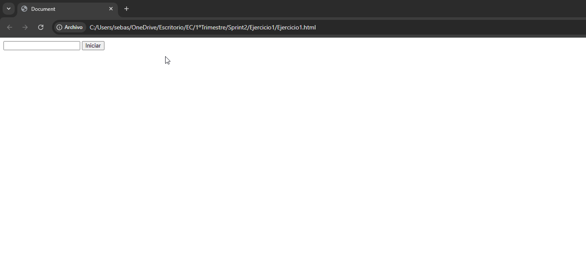


# Ejercicio 2:  Calculadora básica

## Análisis del Problema

El objetivo del ejercicio es crear una calculadora básica que permita realizar operaciones de suma, resta, multiplicación y división. Los usuarios deben poder introducir dos números y seleccionar una operación. Al hacer clic en "Calcular", se debe mostrar el resultado de la operación seleccionada.Se entregarán dos archivos:

- **ejercicio2.html**: Estructura de la página web.
- **ejercicio2.js**: Funcionalidad de la página para ejecutar operaciones.

## Diseño de la Propuesta de Solución

Para resolver el problema del primer ejercicio he tenido que hacer estos pasos:

1. **HTML (ejercicio2.html)**: En el html he tenido que crear previamente llamado `ejercicio2.html` , he comenzado con la etructura básica utilizando el atajo html:5 donde dentro del body he puesto script donde dentro de el he puesto un src para enlazarlo con el archivo .js , el codigo cual ha quedado asi :**\<script src="Ejercicio2.js"></script>**. Después tuve que crear dos campos de entrada con la etiqueta input, un botón llamado `Calcular`, y por último una lista de selección lo caul para comprendelo pregunté a chat gpt:

- **Pregunta 1:** como es una lista select para elegir algo en un html


###

2. **JavaScript (ejercicio2.js)**: En este archivo .js le pregunté esto a chat gpt :

- **Pregunta 1:** tengo este html
```
<!DOCTYPE html>
<html lang="en">
<head>
    <meta charset="UTF-8">
    <meta name="viewport" content="width=device-width, initial-scale=1.0">
    <title>Document</title>
</head>
<body>
    <input type="text">
    <select name="opciones" id="opciones">
        <option value="opc1">Suma</option>
        <option value="opc2">Resta</option>
        <option value="opc3">Multiplicación</option>
        <option value="opc4">División</option>
    </select>
    <input type="text">
    <button id="Calcula">Calcular</button>
    
    <script src="Ejercicio2.js"></script>
</body>
</html>
```

- **Pregunta 2:** quiero que hagas esto JS: Detectar el evento click en el botón "Calcular", capturar los valores de los campos y realizar la operación matemática seleccionada. Mostrar el resultado en la página.
Objetivos:
Manejo de eventos (click).
Validación de entradas de usuario (asegurarse de que los campos no estén vacíos).
Uso de métodos matemáticos básicos (+, -, *, /).

### Diagrama de Flujo
A continuación, se muestra un diagrama de flujo simple que explica el proceso del evento:

```plaintext
   +------------------------+
   |      Página cargada    |
   +------------------------+
             |
             v
   +------------------------+
   | Usuario introduce      |
   | dos números            |
   +------------------------+
             |
             v
   +------------------------+
   | Usuario selecciona     |
   | operación (suma, resta,|
   |multiplicación,división)|
   +------------------------+
             |
             v
   +------------------------+
   | Usuario pulsa botón    |
   | "Calcular"             |
   +------------------------+
             |
             v
   +------------------------+
   | Capturar valores de    |
   | los campos y operación |
   +------------------------+
             |
             v
   +------------------------+
   | Realizar operación     |
   | seleccionada           |
   +------------------------+
             |
             v
   +------------------------+
   | Mostrar resultado en   |
   | la página              |
   +------------------------+
             |
             v
   +------------------------+
   | Esperar nuevos valores |
   | y operación o          |
   | reiniciar cálculo      |
   +------------------------+

```

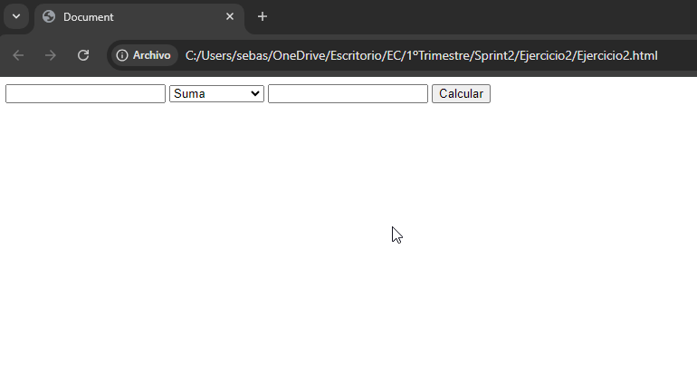
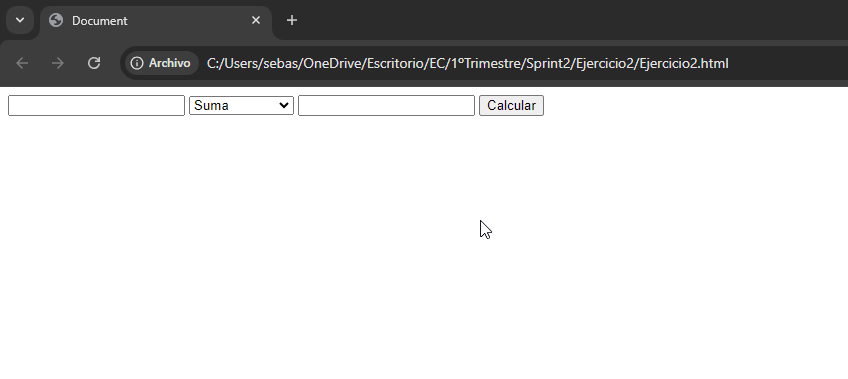
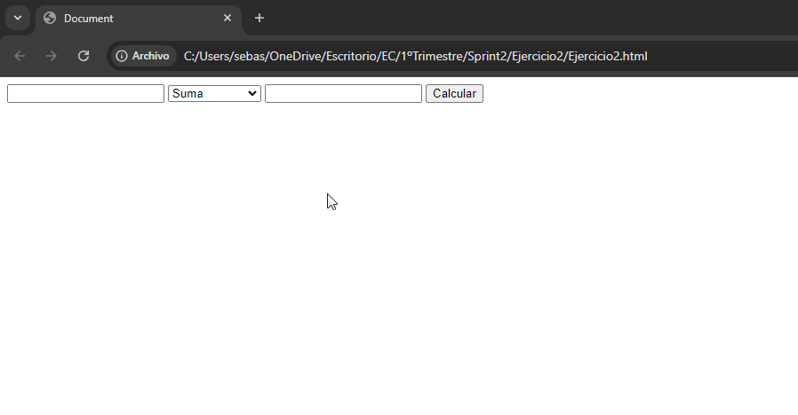
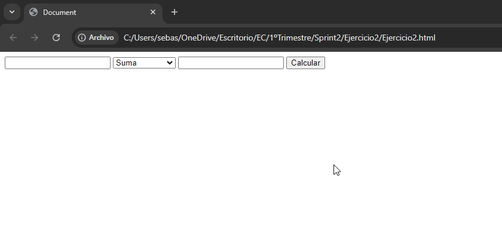

# Ejercicio 3: Encuesta con gráficos de resultados

## Análisis del Problema

El objetivo del ejercicio es crear una página con una pequeña encuesta donde el usuario puede seleccionar una opción entre varias (por ejemplo: "¿Cuál es tu color favorito?"). Al enviar la respuesta, se deben mostrar los resultados en un gráfico de barras simple que se actualice dinámicamente cada vez que se envía una respuesta.
Se entregarán dos archivos:

- **ejercicio1.html**: Estructura de la página web.
- **ejercicio1.js**: Funcionalidad de la página para mostrar los resultados de la encuesta.

## Diseño de la Propuesta de Solución

Para resolver el problema del primer ejercicio he tenido que hacer estos pasos:

1. **HTML (ejercicio3.html)**: En el html he tenido que crear previamente llamado `ejercicio3.html` , he comenzado con la etructura básica utilizando el atajo html:5 donde dentro del body he puesto script donde dentro de el he puesto un src para enlazarlo con el archivo .js , el codigo cual ha quedado asi :**\<script src="Ejercicio3.js"></script>**. Después creado un botón Enviar, hice una encuesta con varias opciones usando radio buttons pero no sabía lo que era así que tuve que informarme preguntando achat gpt: 

- **Pregunta 1:** que es y como se utiliza radio buttons en html para preguntar con varias opciones

###

- **Pregunta 2:** otra pregunta como se haria un area para mostrar dinamicamente los resultados en un diagrama de barras


###

2. **JavaScript (ejercicio2.js)**: En este archivo .js tuve que preguntar a chatgpt: 

- **Pregunta 1:** Compartir

tengo este html 
```
<!DOCTYPE html>
<html lang="en">
<head>
    <meta charset="UTF-8">
    <meta name="viewport" content="width=device-width, initial-scale=1.0">
    <title>Document</title>
</head>
<body>
    <form>
        <label>
            <input type="radio" name="color" value="rojo">
            Sevilla
        </label><br>
    
        <label>
            <input type="radio" name="color" value="verde">
            Betis
        </label><br>
    
        <label>
            <input type="radio" name="color" value="negro">
            Otro
        </label><br>

        <button id="enviar">Enviar</button>
    </form>

    <div class="chart-container">
        <h2>Resultados</h2>
        <div id="results"></div>
    </div>

   
    <script src="Ejercicio3.js"></script>
</body>
</html>
```

###

- **Pregunta 2:** ahora quiero que hagas esto JS: Detectar el evento click en el botón "Enviar", actualizar las respuestas seleccionadas y generar un gráfico de barras simple manipulando el DOM. El gráfico puede ser construido con divs o tablas que cambian su tamaño en función de los votos.
Objetivos:
Manejo de eventos (click).
Manipulación del DOM para actualizar el gráfico de barras dinámicamente.
Lógica para contar votos y reflejar visualmente. SIN CSS 

###

- **Pregunta 3:** en este js no se ve las barras de votos hay que hacer algun cambio en el html o en css

### Diagrama de Flujo
A continuación, se muestra un diagrama de flujo simple que explica el proceso del evento:

```plaintext
   +------------------------+
   |      Página cargada    |
   +------------------------+
             |
             v
   +------------------------+
   | Mostrar pregunta:      |
   | "¿Cuál es tu equipo    |
   | favorito?"             |
   +------------------------+
             |
             v
   +------------------------+
   | Usuario selecciona     |
   | opción (radio buttons) |
   +------------------------+
             |
             v
   +------------------------+
   | Usuario pulsa botón    |
   | "Enviar"               |
   +------------------------+
             |
             v
   +------------------------+
   | Capturar respuesta     |
   | seleccionada           |
   +------------------------+
             |
             v
   +------------------------+
   | Actualizar conteo de   |
   | respuestas             |
   +------------------------+
             |
             v
   +------------------------+
   | Generar gráfico de     |
   | barras dinámico        |
   | en función de los votos|
   +------------------------+
             |
             v
   +------------------------+
   | Mostrar gráfico en la  |
   | página                 |
   +------------------------+
             |
             v
   +------------------------+
   | Esperar nueva respuesta|
   | o reiniciar encuesta   |
   +------------------------+

```

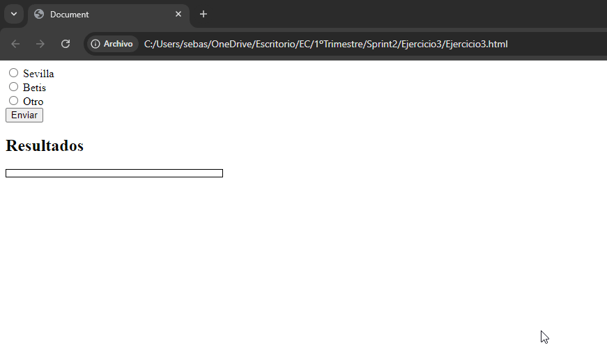
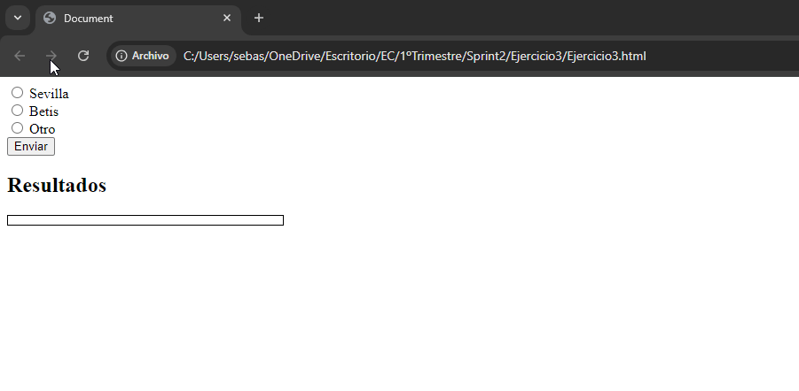
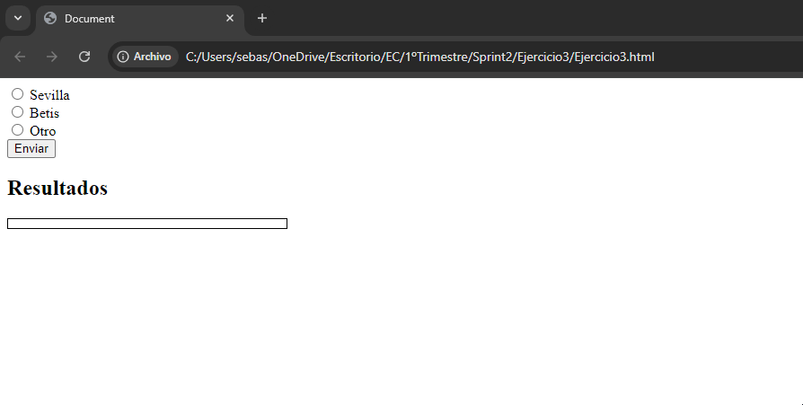
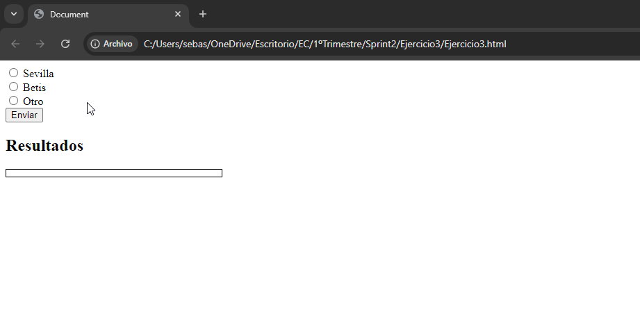

# Ejercicio 4:  Cronómetro con controles de inicio, pausa y reinicio


## Análisis del Problema

El objetivo del ejercicio es crear un cronómetro que permita al usuario iniciarlo, pausarlo y reiniciarlo. El cronómetro debe actualizarse cada segundo y mostrar el tiempo en minutos y segundos. Se entregarán dos archivos:

- **ejercicio1.html**: Estructura de la página web.
- **ejercicio1.js**: Funcionalidad de la página ara cambiar el color del fondo y elcolor de las palabras

## Diseño de la Propuesta de Solución

1. **HTML (ejercicio3.html)**: En el html he tenido que crear previamente llamado `ejercicio4.html` , he comenzado con la etructura básica utilizando el atajo html:5 donde dentro del body he puesto script donde dentro de el he puesto un src para enlazarlo con el archivo .js , el codigo cual ha quedado asi :**\<script src="Ejercicio4.js"></script>**. Después arriba de la etiqueta script he creado tres buttons y despues un div para que se viera el cronómetro.

###

2. **JavaScript (ejercicio2.js)**: En este archivo .js lo primero que hice fue inicializar una constante llamada divs que seria igual a `querySelectorAll` esto se lo pregunte a chat gpt con la pregunta de abajo, después hice dos funciones una que fue para poder cambiar los colores llamada `cambiarColorPasar` y otra llamada `restaurarColor`que tendrian entre parentesis la etiqueta que quiero cambiar y viendo ejercicios anteriores los pude hacer después de varios intento por ultimo hice un div.foEach pero no lo sabía hacer asi que tuve que preguntar a chatgpt: 

- **Pregunta 1:** con este html 

```
<!DOCTYPE html>
<html lang="en">
<head>
    <meta charset="UTF-8">
    <meta name="viewport" content="width=device-width, initial-scale=1.0">
    <title>Document</title>
</head>
<body>
    <div id="display">00:00</div> 

    <button id="iniciar">Iniciar</button>
    <button id="pausar">Pausar</button>
    <button id="reiniciar">Reiniciar</button>
    
    <script src="Ejercicio4.js"></script>
</body>
</html>
```

- **Pregunta 2:** Haz esto Crear un cronómetro que permita al usuario iniciarlo, pausarlo y reiniciarlo. El cronómetro debe actualizarse cada segundo y mostrar el tiempo en minutos y segundos.HTML: Botones para "Iniciar", "Pausar" y "Reiniciar", y un área para mostrar el tiempo.
JS: Detectar los eventos click en los botones para iniciar el cronómetro, detenerlo y reiniciarlo. Usar setInterval para actualizar el cronómetro cada segundo.
Objetivos:
Uso avanzado de eventos (click en múltiples botones).
Métodos como setInterval, clearInterval.
Manipulación continua del DOM (actualización del tiempo).


### Diagrama de Flujo
A continuación, se muestra un diagrama de flujo simple que explica el proceso del evento:

```plaintext
   +------------------------+
   |   Página cargada       |
   +------------------------+
             |
             v
   +------------------------+
   | Usuario pulsa botón    |
   | "Iniciar"              |
   +------------------------+
             |
             v
   +------------------------+
   |Iniciar cuenta regresiva|
   | cada segundo           |
   +------------------------+
             |
             v
   +------------------------+
   | Actualizar tiempo en   |
   | pantalla (minutos y    |
   | segundos)              |
   +------------------------+
             |
             v
   +------------------------+
   | Esperar acción del     |
   | usuario (pausar o      |
   | reiniciar)             |
   +------------------------+
             |
        +----+-------------------------------+
        |                                    |
        v                                    v
   +------------------------+       +------------------------+
   | Usuario pulsa botón     |       | Usuario pulsa botón   |
   | "Pausar"                |       | "Reiniciar"           |
   +------------------------+       +------------------------+
        |                                    |
        v                                    v
   +------------------------+       +------------------------+
   | Pausar cuenta          |       | Reiniciar cronómetro   |
   | regresiva              |       | (resetear tiempo)      |
   +------------------------+       +------------------------+
        |                                    |
        v                                    v
   +------------------------+       +------------------------+
   | Mostrar tiempo pausado |       |Mostrar tiempo en"00:00"|
   | en pantalla            |       +------------------------+
   +------------------------+

```

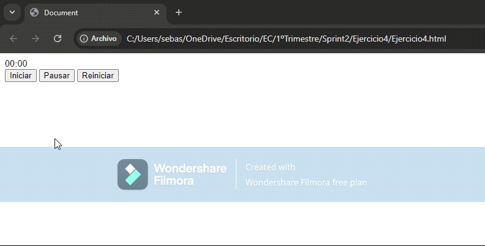
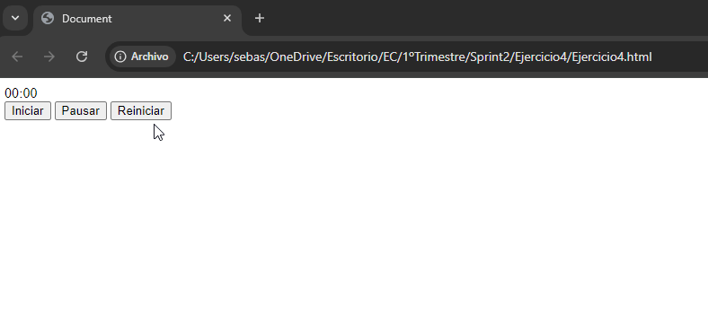
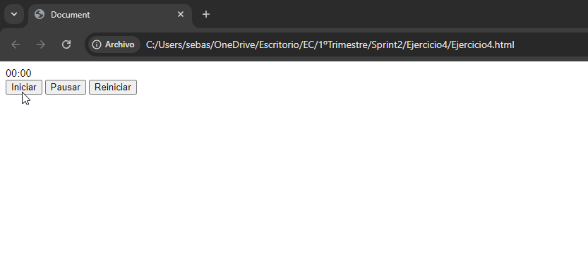

# Ejercicio 5:   Juego de memoria con cartas

## Análisis del Problema

El objetivo del ejercicio es crear un juego de memoria donde el usuario debe hacer clic en dos cartas para ver si coinciden. Si las cartas coinciden, permanecen boca arriba, si no, se voltean nuevamente después de un breve intervalo. El objetivo es encontrar todas las parejas de cartas.

Se entregarán dos archivos:

- **ejercicio1.html**: Estructura de la página web.
- **ejercicio1.js**: Funcionalidad de la página juego de la pareja de cartas


## Diseño de la Propuesta de Solución

1. **HTML (ejercicio3.html)**: En el html he tenido que crear previamente llamado `ejercicio5.html` , he comenzado con la etructura básica utilizando el atajo html:5 donde dentro del body he puesto script donde dentro de el he puesto un src para enlazarlo con el archivo .js , el codigo cual ha quedado asi :**\<script src="Ejercicio5.js"></script>**. Después he creadp un div , un parrafo y un boton para reiniciar.

###

2. **JavaScript (ejercicio2.js)**: En este archivo .js tuve que recurrir al chat gpt: 

- **Pregunta 1:** Ejercicio 5: Juego de memoria con cartas
Descripción: Crear un juego de memoria donde el usuario debe hacer clic en dos cartas para ver si coinciden. Si las cartas coinciden, permanecen boca arriba, si no, se voltean nuevamente después de un breve intervalo. El objetivo es encontrar todas las parejas de cartas.
HTML: Crear una cuadrícula de cartas (pueden ser imágenes o solo texto, como números o letras).
JS: Detectar el evento click en cada carta. Usar lógica para manejar la comparación de cartas seleccionadas, y un temporizador para voltearlas si no coinciden. Al final, mostrar un mensaje cuando el jugador haya encontrado a todas las parejas.
Objetivos:
Uso avanzado de eventos (click en elementos dinámicos).
Uso de métodos de temporización como setTimeout para la lógica de volteo.
Lógica condicional compleja para comparar cartas y gestionar el estado del juego.
Manipulación dinámica del DOM (mostrar/ocultar cartas y actualización del estado del juego).
Pruebas: Vídeos GIF en Readme.md en el que se muestre lo siguiente:
Verificar que las cartas se voltean al hacer clic y se quedan volteadas si coinciden.
Comprobar que dos cartas no coincidentes se voltean de nuevo después de un breve intervalo.
Probar que el juego detecta cuando se han encontrado todas las parejas y muestra un mensaje de finalización.
Verificar que el juego puede reiniciarse correctamente barajando las cartas de nuevo.


### Diagrama de Flujo
A continuación, se muestra un diagrama de flujo simple que explica el proceso del evento:

```plaintext
   +------------------------+
   |      Página cargada    |
   +------------------------+
             |
             v
   +------------------------+
   | Mostrar cuadrícula de  |
   | cartas (boca abajo)    |
   +------------------------+
             |
             v
   +------------------------+
   | Usuario hace clic en   |
   | una carta              |
   +------------------------+
             |
             v
   +------------------------+
   | Voltear carta          |
   | (mostrar contenido)    |
   +------------------------+
             |
             v
   +------------------------+
   | Usuario selecciona     |
   | una segunda carta      |
   +------------------------+
             |
             v
   +------------------------+
   | Voltear segunda carta  |
   | (mostrar contenido)    |
   +------------------------+
             |
             v
   +------------------------+
   | Comparar cartas        |
   +------------------------+
        /            \
   (Coinciden)     (No coinciden)
       |               |
       v               v
+----------------+  +--------------------+
| Mantener cartas|  | Usar setTimeout    |
| volteadas      |  | para voltear ambas |
+----------------+  | cartas nuevamente  |
       |            +--------------------+
       v                    |
+------------------------+  v
| Comprobar si todas las |+----------------+
| parejas han sido       |                 |
| encontradas            |                 |
+------------------------+                 |
       |                                   |
       v                                   |
+------------------------+          +------------------------+
| Mostrar mensaje de     |          | Continuar con el juego |
| victoria si todas las  |<---------| hasta encontrar todas  |
| parejas están encontradas|        | las parejas            |
+------------------------+          +------------------------+
             |
             v
   +------------------------+
   | Barajar y reiniciar    |
   | el juego               |
   +------------------------+

```

## Análisis del Problema
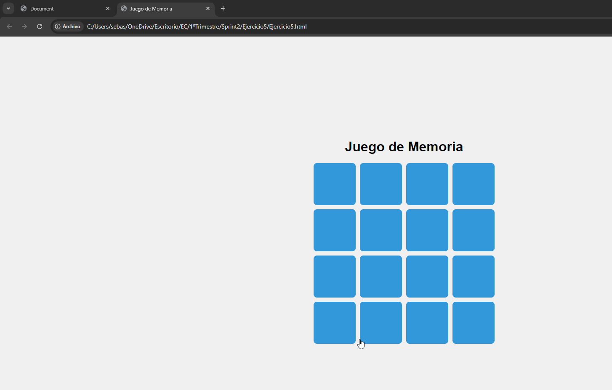
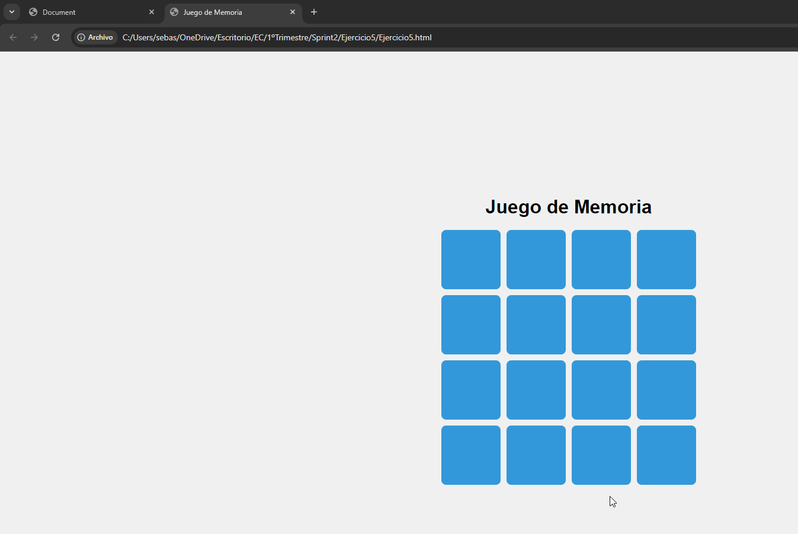
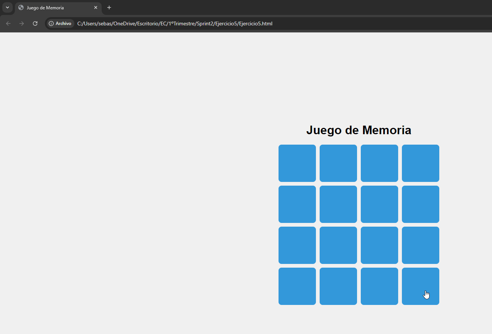
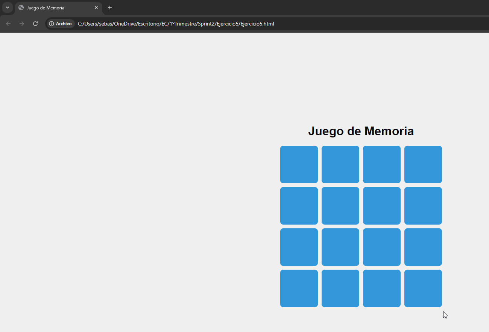


