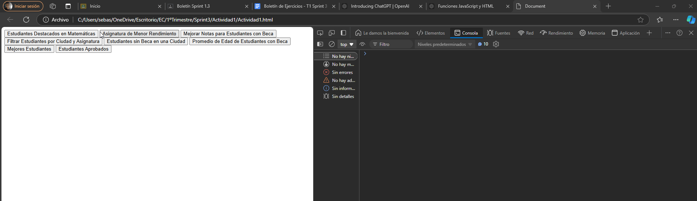
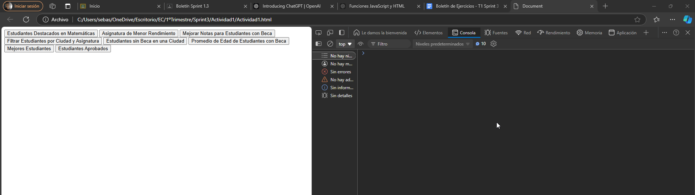
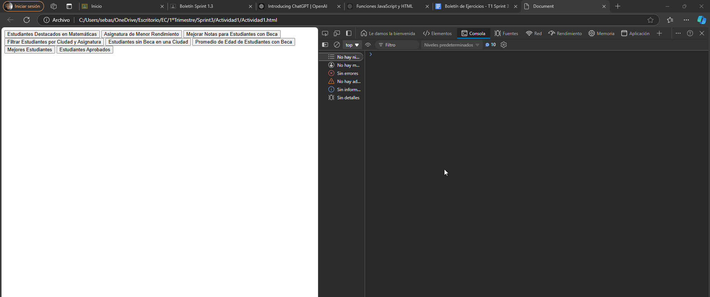
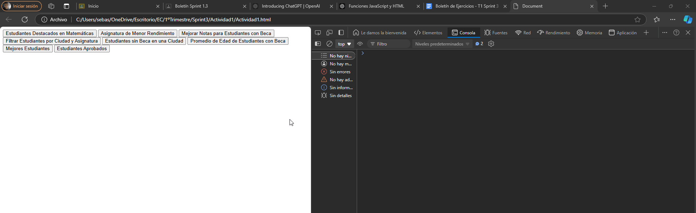
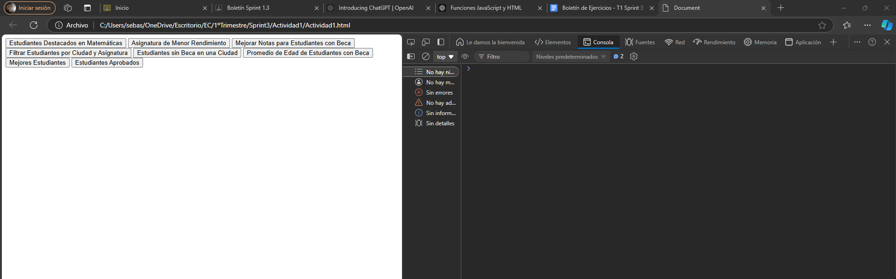
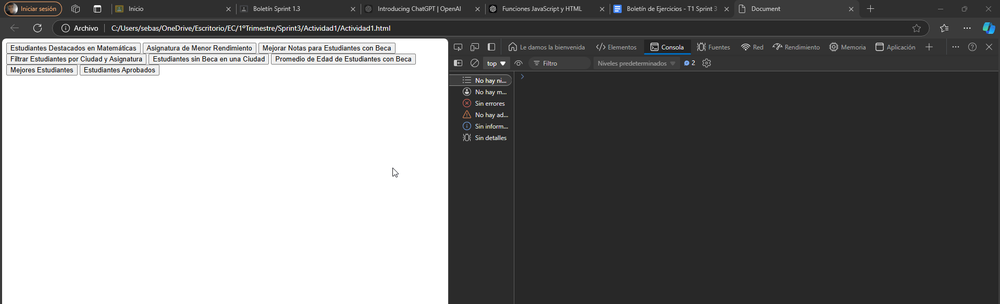
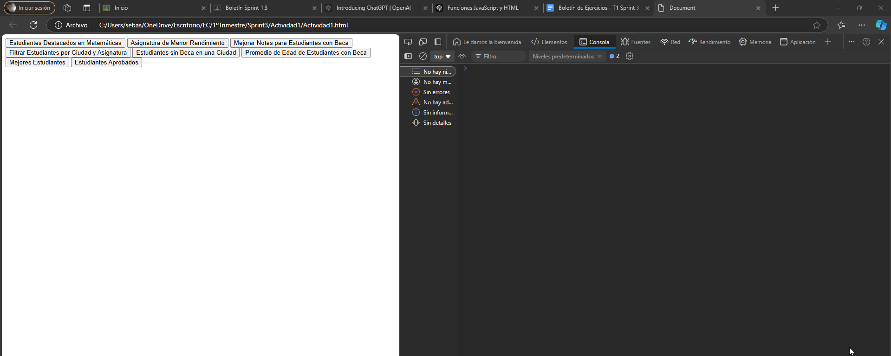

# EC

# Ejercicio 1: Análisis y Transformación Avanzada de Datos


## Análisis del Problema
El objetivo del ejercicio es dado un conjunto de datos en forma de array con información sobre estudiantes, sus calificaciones en diferentes asignaturas y detalles adicionales, implementa funciones para analizar, filtrar y transformar estos datos.
Se entregarán dos archivos:

- **ejercicio1.html**: Estructura de la página web.
- **ejercicio1.js**: Funcionalidad de la página.

## Diseño de la Propuesta de Solución
Para resolver el problema del primer ejercicio he tenido que hacer estos pasos:

1. **HTML (ejercicio1.html)**: En el html solamente he tenido que crear la estructura básica, hacer un boton para cada función como pide en el enunciado para ver mejor las pruebas y conectarlo al .js`.

###

2. **JavaScript (ejercicio1.js)**: En este archivo .js tuve que hacer las funciones solicitadas en el ejercicio la primera funcion la tuve que pedir a chat gpt porque no sabía su estructura y a partir de ella me fui ayudando para las demás, y en las que tenía más problemas se lo pedía a chat gpt como la función 7:

###

- **Pregunta 1:**. tengo este html 
```
este es el html <!DOCTYPE html>
<html lang="en">
<head>
    <meta charset="UTF-8">
    <meta name="viewport" content="width=device-width, initial-scale=1.0">
    <title>Document</title>
</head>
<body>
    <script src="Actividad1.js"></script>
</body>
</html> y este el js const estudiantes = [
    { nombre: "Juan", ciudad: "Madrid", beca: false, edad: 21, calificaciones: { matematicas: 5, fisica: 7, historia: 6 } },
    { nombre: "Ana", ciudad: "Barcelona", beca: true, edad: 20, calificaciones: { matematicas: 9, fisica: 6, historia: 8 } },
    { nombre: "Pedro", ciudad: "Madrid", beca: false, edad: 23, calificaciones: { matematicas: 4, fisica: 5, historia: 7 } },
    { nombre: "Maria", ciudad: "Sevilla", beca: true, edad: 19, calificaciones: { matematicas: 8, fisica: 7, historia: 9 } },
    { nombre: "Jose", ciudad: "Madrid", beca: false, edad: 22, calificaciones: { matematicas: 6, fisica: 7, historia: 5 } },
    { nombre: "Isabel", ciudad: "Valencia", beca: true, edad: 20, calificaciones: { matematicas: 5, fisica: 8, historia: 7 } },
    { nombre: "David", ciudad: "Bilbao", beca: false, edad: 24, calificaciones: { matematicas: 7, fisica: 6, historia: 8 } },
    { nombre: "Laura", ciudad: "Barcelona", beca: true, edad: 19, calificaciones: { matematicas: 6, fisica: 8, historia: 7 } },
    { nombre: "Miguel", ciudad: "Sevilla", beca: false, edad: 21, calificaciones: { matematicas: 7, fisica: 7, historia: 8 } },
    { nombre: "Sara", ciudad: "Madrid", beca: true, edad: 20, calificaciones: { matematicas: 6, fisica: 5, historia: 9 } },
    { nombre: "Daniela", ciudad: "Valencia", beca: false, edad: 22, calificaciones: { matematicas: 8, fisica: 9, historia: 6 } },
    { nombre: "Alberto", ciudad: "Bilbao", beca: true, edad: 23, calificaciones: { matematicas: 5, fisica: 8, historia: 6 } },
    { nombre: "Gabriel", ciudad: "Sevilla", beca: false, edad: 19, calificaciones: { matematicas: 8, fisica: 5, historia: 7 } },
    { nombre: "Carmen", ciudad: "Barcelona", beca: true, edad: 24, calificaciones: { matematicas: 9, fisica: 9, historia: 9 } },
    { nombre: "Roberto", ciudad: "Madrid", beca: false, edad: 20, calificaciones: { matematicas: 4, fisica: 5, historia: 5 } },
    { nombre: "Carolina", ciudad: "Valencia", beca: true, edad: 22, calificaciones: { matematicas: 5, fisica: 7, historia: 6 } },
    { nombre: "Alejandro", ciudad: "Bilbao", beca: false, edad: 23, calificaciones: { matematicas: 9, fisica: 8, historia: 8 } },
    { nombre: "Lucia", ciudad: "Barcelona", beca: true, edad: 21, calificaciones: { matematicas: 7, fisica: 7, historia: 7 } },
    { nombre: "Ricardo", ciudad: "Sevilla", beca: false, edad: 19, calificaciones: { matematicas: 6, fisica: 5, historia: 6 } },
    { nombre: "Marina", ciudad: "Madrid", beca: true, edad: 20, calificaciones: { matematicas: 5, fisica: 9, historia: 8 } }
];


function estudiantesDestacadosPorAsignatura(estudiantes, asignatura) {
    return estudiantes.map(estudiante => ({ nombre: estudiante.nombre, calificacion: estudiante.calificaciones[asignatura] }))
        .sort((a, b) => b.calificacion - a.calificacion).slice(0, 3);
}

console.log(estudiantesDestacadosPorAsignatura(estudiantes, "matematicas"));


function asignaturaMenorRendimiento(estudiantes) {

    const asignaturas = ["matematicas", "fisica", "historia"];

    const promedios = asignaturas.map(asignatura => {
        const total = estudiantes.reduce((sum, estudiante) => sum + estudiante.calificaciones[asignatura], 0);
        return { asignatura, promedio: total / estudiantes.length };
    });

    return promedios.reduce((min, asignatura) => asignatura.promedio < min.promedio ? asignatura : min);
}

console.log(asignaturaMenorRendimiento(estudiantes));

function mejoraNotasBeca(estudiantes) {
    
    estudiantes.forEach(estudiante => {
        if (estudiante.beca) {
            for (let asignatura in estudiante.calificaciones) {
                estudiante.calificaciones[asignatura] = Math.min(estudiante.calificaciones[asignatura] * 1.1, 10);
            }
        }
    });
    return estudiantes;
}

console.log(mejoraNotasBeca(estudiantes));

function filtrarPorCiudadYAsignatura(estudiantes, ciudad, asignatura) {
    
    return estudiantes.filter(estudiante => estudiante.ciudad === ciudad)
    .sort((a,b) => a.calificaciones[asignatura] - b.calificaciones[asignatura]);
}

console.log(filtrarPorCiudadYAsignatura(estudiantes, "Madrid", "matematicas"));


function estudiantesSinBecaPorCiudad(estudiantes, ciudad) {
  
    return estudiantes.filter(estudiante => estudiante.ciudad === ciudad && !estudiante.beca).length;
}

console.log(estudiantesSinBecaPorCiudad(estudiantes, "Huelva"));

function promedioEdadEstudiantesConBeca(estudiantes) {
    
    const estudiantesConBeca = estudiantes.filter(estudiante => estudiante.beca);
    return estudiantesConBeca.reduce((sum, estudiante) => sum + estudiante.edad, 0) / estudiantesConBeca.length;
}

console.log(promedioEdadEstudiantesConBeca(estudiantes));

function mejoresEstudiantes(estudiantes) {
    // Devuelve un array con los 2 estudiantes con el mejor promedio general
    return estudiantes.map(estudiante => {
        const promedio = (estudiante.calificaciones.matematicas + estudiante.calificaciones.fisica + estudiante.calificaciones.historia) / 3;
        return { nombre: estudiante.nombre, promedio };
    }).sort((a, b) => b.promedio - a.promedio).slice(0, 2);
}

console.log(mejoresEstudiantes(estudiantes));


function estudiantesAprobados(estudiantes) {
   
    return estudiantes.filter(estudiante => {
        for (let asignatura in estudiante.calificaciones) {
            if (estudiante.calificaciones[asignatura] < 5) {
                return false;
            }
        }
        return true;
    }).map(estudiante => estudiante.nombre);
}

console.log(estudiantesAprobados(estudiantes)); el ejercicio me muestra en consola los datos correctamente pero he visto que me pone esto en el enunciado habria que cambiar algo? Poned que las funciones se aplican cuando se pulsan botones diferentes, para que así podáis realizar una única prueba para probar cada una de las funciones en cada paso, es decir, paso 1, hacer click en el botón de la función “estudiantesDestacadosPorAsignatura()”, resultado esperado, lo que devuelve ese método y así sucesivamente con el resto de funciones.

```

###

### Diagrama de Flujo
A continuación, se muestra un diagrama de flujo simple que explica el proceso del evento:

```plaintext
   +-----------------------------+
   |        Página cargada       |
   +-----------------------------+
               |
               v
   +-----------------------------+
   | Usuario pulsa botón para    |
   | ejecutar una función        |
   +-----------------------------+
               |
               v
   +-----------------------------+
   | Revisar qué botón fue       |
   | pulsado                     |
   +-----------------------------+
               |
               v
   +-----------------------------+
   | Ejecutar función            |
   | correspondiente y mostrar   |
   | resultado en consola        |
   +-----------------------------+
               |
               v
   +-----------------------------+
   | Esperar nuevo clic para     |
   | ejecutar otra función       |
   +-----------------------------+

```
Estudiantes Destacados por Asignatura

Asignatura con Menor Rendimiento

Mejora de Notas para Estudiantes con Beca

Filtrado por Ciudad y Asignatura

Estudiantes Sin Beca por Ciudad

Promedio de Edad de Estudiantes con Beca

Mejores Estudiantes en Total

Estudiantes con Todas las Materias Aprobadas
