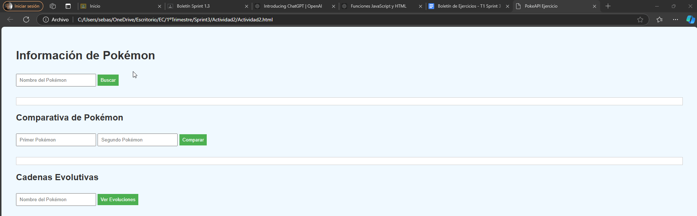
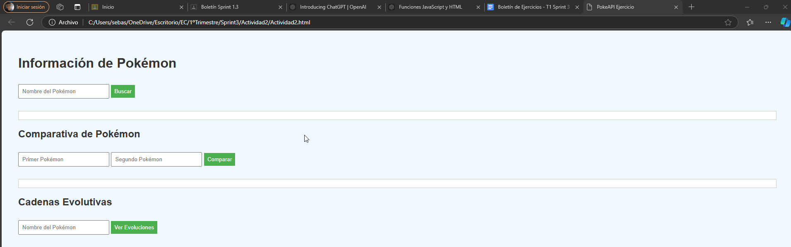
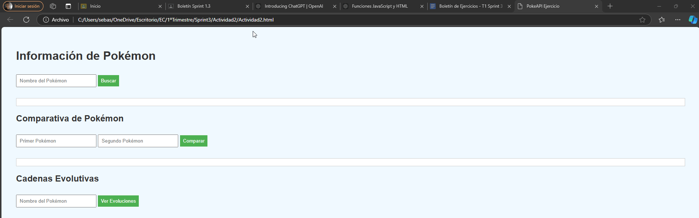
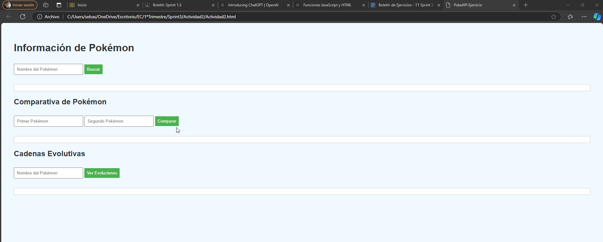
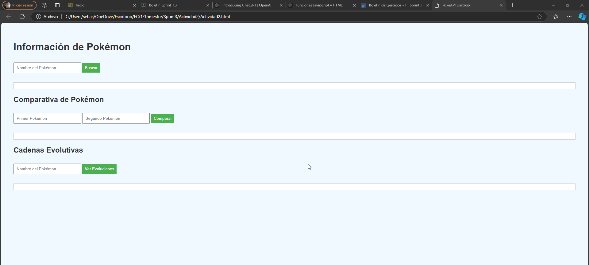
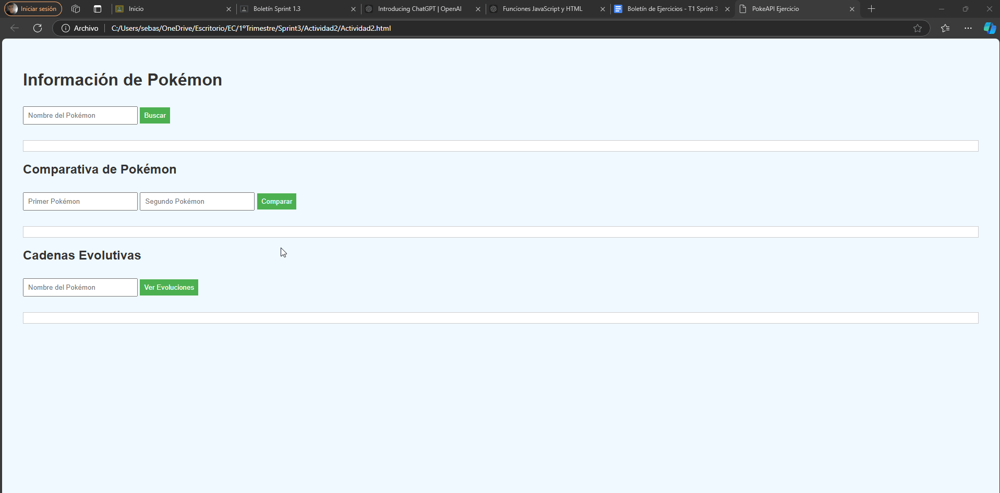
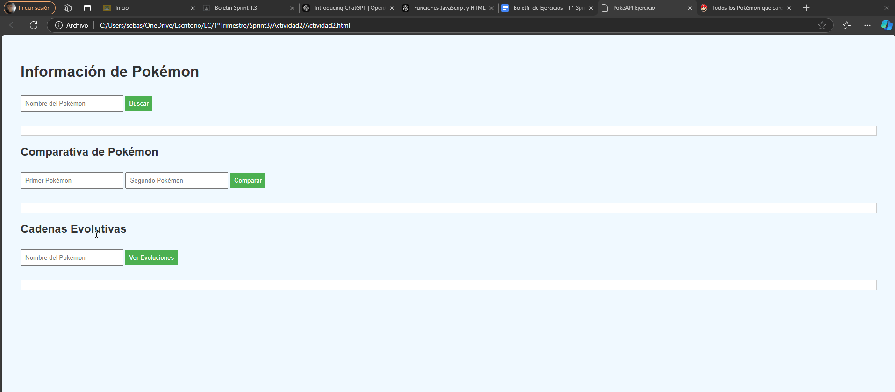

# EC

# Ejercicio 2: Uso de PokeAPI

## Análisis del Problema
El objetivo del ejercicio es Realizar una petición a la PokeAPI para obtener información básica de un Pokémon por su nombre. Mostrar el nombre, id, tipos, y una imagen del Pokémon.Gestionar errores de manera adecuada si el Pokémon no existe.Obtener datos de dos Pokémon elegidos por el usuario. Comparar sus estadísticas base (stats) y determinar cuál de ellos tiene mejores estadísticas generales. Presentar los resultados en una tabla comparativa de fácil lectura.Dado un Pokémon específico, buscar su cadena de evolución completa. Listar cada una de las formas evolutivas y sus habilidades. Incluir un botón que permita al usuario ver más detalles de cualquier habilidad (usando un modal o una nueva vista):

- **ejercicio2.html**: Estructura de la página web.
- **ejercicio2.js**: Funcionalidad de la página.

## Diseño de la Propuesta de Solución
Para resolver el problema del primer ejercicio he tenido que hacer estos pasos:

2. **HTML (ejercicio2.html)**: En el html tuve que crear 4 divs para la informacion del pokemon , comparativa de pokemon, cadenas evolutivas ,los modales y conectarlo al .js`.

###

2. **JavaScript (ejercicio2.js)**: En este archivo .js tuve que hacer las funciones solicitadas en el ejercicio, en este tuve que preguntarle a chat gpt:

###

- **Pregunta 1:**. tengo este html 
```
<!DOCTYPE html>
<html lang="es">
<head>
    <meta charset="UTF-8">
    <meta name="viewport" content="width=device-width, initial-scale=1.0">
    <title>PokeAPI Ejercicio</title>
    <link rel="stylesheet" href="Actividad2.css">
</head>
<body>
    <h1>Información de Pokémon</h1>

    <div id="infoPokemon">
        <input type="text" id="nombrePokemon" placeholder="Nombre del Pokémon">
        <button onclick="obtenerInfoBasicaPokemon()">Buscar</button>
        <div id="resultadoPokemon"></div>
    </div>

    <h2>Comparativa de Pokémon</h2>
    <div id="comparativa">
        <input type="text" id="pokemon1" placeholder="Primer Pokémon">
        <input type="text" id="pokemon2" placeholder="Segundo Pokémon">
        <button onclick="compararPokemon()">Comparar</button>
        <div id="resultadoComparativa"></div>
    </div>

    <h2>Cadenas Evolutivas</h2>
    <div id="cadenaEvolutiva">
        <input type="text" id="pokemonEvolutivo" placeholder="Nombre del Pokémon">
        <button onclick="obtenerCadenaEvolutiva()">Ver Evoluciones</button>
        <div id="resultadoEvolutivo"></div>
    </div>

    <!-- Modal -->
    <div id="modal" class="modal">
        <div class="modal-content">
            <span class="close" onclick="cerrarModal()">&times;</span>
            <h2 id="tituloHabilidad"></h2>
            <p id="descripcionHabilidad"></p>
        </div>
    </div>

    <script src="Actividad2.js"> </script>
</body>
</html>

hazme primero esta parte 

Parte 1: Información Básica del Pokémon
Realizar una petición a la PokeAPI para obtener información básica de un Pokémon por su nombre.
Mostrar el nombre, id, tipos, y una imagen del Pokémon.
Gestionar errores de manera adecuada si el Pokémon no existe.

Parte 2: Comparativa de Pokémon
Obtener datos de dos Pokémon elegidos por el usuario.
Comparar sus estadísticas base (stats) y determinar cuál de ellos tiene mejores estadísticas generales.
Presentar los resultados en una tabla comparativa de fácil lectura.

Parte 3: Evoluciones y Habilidades
Dado un Pokémon específico, buscar su cadena de evolución completa.
Listar cada una de las formas evolutivas y sus habilidades.
Incluir un botón que permita al usuario ver más detalles de cualquier habilidad (usando un modal o una nueva vista).


```

###

### Diagrama de Flujo
A continuación, se muestra un diagrama de flujo simple que explica el proceso del evento:
Parte 1: Información Básica del Pokémon
```plaintext
      +-----------------------------+
   | Iniciar función             |
   | obtenerInfoBasicaPokemon    |
   +-----------------------------+
               |
               v
   +-----------------------------+
   | Realizar petición a PokeAPI |
   | usando el nombre del Pokémon|
   +-----------------------------+
               |
               v
   +-----------------------------+
   | ¿Petición exitosa?          |
   +-----------------------------+
            /                      \
           /                        \
      Sí  /                          \ No
         v                            v
   +-----------------------------+      +-----------------------------+
   | Extraer nombre, id, tipos,  |      | Mostrar mensaje de error:  |
   | e imagen del Pokémon        |      | "Pokémon no encontrado"    |
   +-----------------------------+      +-----------------------------+
               |
               v
   +-----------------------------+
   | Mostrar información básica  |
   | del Pokémon                 |
   +-----------------------------+
               |
               v
   +-----------------------------+
   | Fin de función              |
   +-----------------------------+


```
Parte 2: Comparativa de Pokémon
```
   +-----------------------------+
   | Iniciar función             |
   | compararPokemon             |
   +-----------------------------+
               |
               v
   +-----------------------------+
   | Realizar petición a PokeAPI |
   | para el primer Pokémon      |
   +-----------------------------+
               |
               v
   +-----------------------------+
   | ¿Primera petición exitosa?  |
   +-----------------------------+
            /                       \
           /                         \
      Sí  /                           \ No
         v                             v
   +-----------------------------+      +-----------------------------+
   | Almacenar datos del         |      | Mostrar mensaje de error:  |
   | primer Pokémon              |      | "Primer Pokémon no existe" |
   +-----------------------------+      +-----------------------------+
               |
               v
   +-----------------------------+
   | Realizar petición a PokeAPI |
   | para el segundo Pokémon     |
   +-----------------------------+
               |
               v
   +-----------------------------+
   | ¿Segunda petición exitosa?  |
   +-----------------------------+
            /                        \
           /                          \
      Sí  /                            \ No
         v                              v
   +-----------------------------+      +-----------------------------+
   | Almacenar datos del         |      | Mostrar mensaje de error:  |
   | segundo Pokémon             |      | "Segundo Pokémon no existe"|
   +-----------------------------+      +-----------------------------+
               |
               v
   +-----------------------------+
   | Comparar estadísticas de    |
   | ambos Pokémon               |
   +-----------------------------+
               |
               v
   +-----------------------------+
   | Crear tabla comparativa con |
   | estadísticas y mostrar      |
   +-----------------------------+
               |
               v
   +-----------------------------+
   | Fin de función              |
   +-----------------------------+
```
Parte 3: Evoluciones y Habilidades
```
  +--------------------------------------+
   | Iniciar función                      |
   | obtenerCadenaEvolutiva               |
   +--------------------------------------+
               |
               v
   +--------------------------------------+
   | Realizar petición a PokeAPI usando   |
   | el nombre del Pokémon para obtener   |
   | información de especie               |
   +--------------------------------------+
               |
               v
   +--------------------------------------+
   | ¿Petición de especie exitosa?        |
   +--------------------------------------+
            /       \
           /         \
      Sí  /           \ No
         v             v
   +--------------------------------------+      +--------------------------------------+
   | Obtener URL de cadena evolutiva y    |      | Mostrar mensaje de error:           |
   | realizar una segunda petición a      |      | "Pokémon no encontrado"             |
   | esa URL                              |      +--------------------------------------+
   +--------------------------------------+
               |
               v
   +--------------------------------------+
   | ¿Petición de cadena evolutiva exitosa?|
   +--------------------------------------+
            /       \
           /         \
      Sí  /           \ No
         v             v
   +--------------------------------------+      +--------------------------------------+
   | Extraer y listar formas evolutivas   |      | Mostrar mensaje indicando que el    |
   | del Pokémon                          |      | Pokémon no tiene cadena evolutiva   |
   +--------------------------------------+      +--------------------------------------+
               |
               v
   +--------------------------------------+
   | Para cada forma evolutiva, obtener y |
   | listar sus habilidades               |
   +--------------------------------------+
               |
               v
   +--------------------------------------+
   | Mostrar lista de evoluciones y       |
   | habilidades                          |
   +--------------------------------------+
               |
               v
   +--------------------------------------+
   | Usuario pulsa botón para ver detalles|
   | de habilidad (opcional)              |
   +--------------------------------------+
               |
               v
   +--------------------------------------+
   | Mostrar detalles de habilidad en     |
   | modal o nueva vista                  |
   +--------------------------------------+
               |
               v
   +--------------------------------------+
   | Fin de función                       |
   +--------------------------------------+
```
Obtener información de "pikachu"

Obtener información de "charizard"

Manejo de error al buscar "fakepokemon"

Comparar "bulbasaur" y "squirtle"

Comparar "gengar" y "alakazam"

Obtener cadena evolutiva de "charmander"

Manejar Pokémon sin cadena evolutiva como "tauros"

