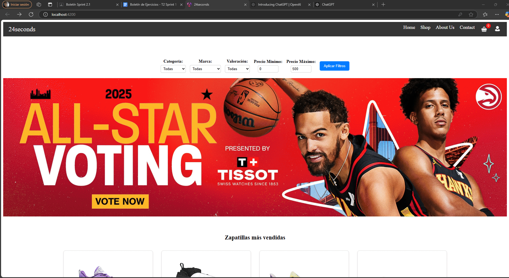
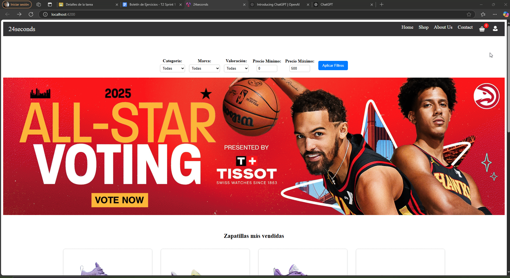
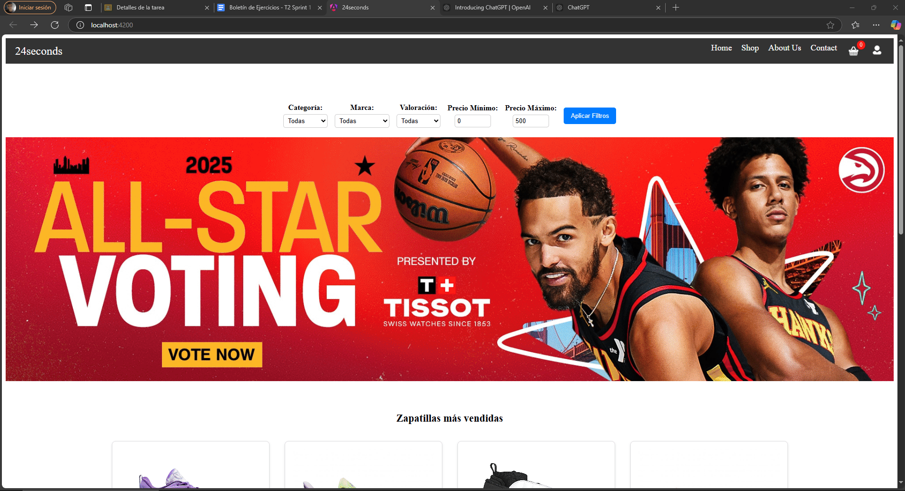

# EC

# Ejercicio 1:  Implementación de la Pantalla de Inicio (Home)

## Análisis del Problema
Desarrollar una Pantalla de Inicio funcional, adaptable y estéticamente atractiva, con los elementos mínimos requeridos según la categoría del proyecto seleccionada.

Estos sin los elementos mínimos Independiente de la categoria

🔝 1. Barra de Navegación (Navbar)
🖼️ 2. Sección Principal (Hero Section)
📄 3. Listado Dinámico de Contenido (Content List)
📄 4. Detalle Resumido del Contenido (Content Card)
📝 5. Pie de Página (Footer)

Los nombres no  han sifo personalizados solo que ContentCard se llama Content Card no el nombre personalizado es decir todo esta como los nombres puestos en el doc de google

## Elementos Específicos (Categoría de Ventas)


1. **Barra de Filtros Avanzados(ProductFilter):**
         - Filtros por categoría, precio, marca y valoración.

2. **Tarjetas de Producto(ContentCard):**
         - Es el uso del “ContentCard.jsx” pero para unos de datos concretos.
         - Imagen del producto, nombre, precio y botón Añadir al carrito, Abrir Chat o Abrir Configurador

3. **Resumen de Carrito(CartPreview):**
        - Icono de carrito con resumen de productos añadidos.

## Diseño de la Propuesta de Solución
Para cumplir con los requerimientos, se implementó una estructura modular y un diseño responsivo. El proyecto utiliza datos mockeados en los archivos .ts dentro de la carpeta services para simular llamadas a una API.:

1. **Estructura del ejercicio**: Organización del código en componentes reutilizables.

- División en módulos para Navbar, Hero Section, Content List, Footer, y elementos específicos como filtros y tarjetas de productos.

###

2. **Archivos mock**: En los archivos lo que hice fue dividir el documento y ve las partes mas pequeñas para poder ir avanzando el ejercicio preguntandole a veces a copilot  hasta que me iba dando lo que necesitaba.

Como por ejemplo cuando estaba con el filtrado ponia las características pero me daba todas las zaatillas de la tienda asi que tuve que preguntarle porque no se ponia el filtrado que le habia puesto
###

### Diagrama de Flujo
A continuación, se muestra un diagrama de flujo simple que explica el proceso del evento:

```plaintext
+-----------------------------+
| Inicio: Cargar Pantalla    |
+-----------------------------+
              |
              v
+-----------------------------+
| Renderizar Navbar           |
+-----------------------------+
              |
              v
+-----------------------------+
| Renderizar Hero Section     |
+-----------------------------+
              |
              v
+-----------------------------+
| Obtener datos mockeados     |
| y renderizar Content List   |
+-----------------------------+
              |
              v
+-----------------------------+
| Aplicar filtros dinámicos  |
| y actualizar vista          |
+-----------------------------+
              |
              v
+-----------------------------+
| Interacción con elementos:  |
| • Añadir al carrito         |
| • Abrir chat/configurador   |
+-----------------------------+
              |
              v
+-----------------------------+
| Mostrar Resumen de Carrito  |
+-----------------------------+
              |
              v
+-----------------------------+
| Renderizar Footer           |
+-----------------------------+
```

### Pruebas Funcionales independientemente de la categoría

**Prueba:** Comprobación de elementos mínimos y específicos
###
- Navegar a la pantalla de Home.
- Comprobar que aparecen los elementos mínimos y específicos definidos anteriormente con el detalle descrito en los diferentes enumerados.


###

# EC

# Ejercicio 2: Implementación de Módulos de Autenticación (Login, Registro y Recuperación de Contraseña)

## Análisis del Problema
El objetivo de este ejercicio es desarrollar un sistema de autenticación completo para la aplicación web. Se deben implementar los componentes de Login, Registro y Recuperación de Contraseña con validaciones avanzadas, interacción con la API mockeadas y una experiencia de usuario fluida y segura.

## Requerimientos Funcionales

1. **Formulario de Inicio de Sesión (Login):**
    - Campos:
      - Correo Electrónico (Email)
      - Contraseña (Password)
      - Casilla de "Recordarme" (Remember Me)
    - Botones:
      - Iniciar Sesión
      - ¿Olvidaste tu contraseña? (Redirige al formulario de recuperación)
    - Validaciones:
      - El correo debe tener un formato válido.
      - La contraseña no puede estar vacía.
      - Mostrar errores en tiempo real.
    - Flujo de Inicio de Sesión:
      - Al hacer clic en Iniciar Sesión, se debe validar el formulario.
      - Si las credenciales son correctas (Poner por defecto el valor 4dA1Ts_2425), redirigir al panel principal.
      - Si hay error (credenciales inválidas), mostrar mensaje claro mediante el NotificationSystem.


2. **Formulario de Registro (Register):**
    - Campos:
      - Nombre de Usuario (Username)
      - Correo Electrónico (Email)
      - Contraseña (Password)
      - Confirmar Contraseña
    - Botones:
      - Registrarse
      - ¿Ya tienes una cuenta? Inicia Sesión (Redirige al formulario de login)
    - Validaciones:
      - El email con formato válido
      - La contraseña debe tener al menos 8 caracteres, incluir una mayúscula, un número y un símbolo.
      - Confirmar que ambas contraseñas coinciden.
      - Verificación de duplicidad de correo o usuario mediante la API
      - Validaciones en tiempo real.
    - Flujo de Inicio de Sesión:
      - Al registrarse correctamente, mostrar notificación de éxito y redirigir al login.
      - Si ocurre un error (simularlo a mano), mostrar notificación de error.


3. **Formulario de Recuperación de Contraseña (Forgot Password):**
    - Campos:
      - Correo electrónico (Email)
    - Botones:
      - Enviar Enlace de Recuperación
      - Volver al Inicio de Sesión
    - Validaciones:
      - El correo debe tener un formato válido.
      - Verificar si el correo está registrado.
    - Flujo de Inicio de Sesión:
      - Al enviar el formulario, se debe enviar una solicitud a la API (pintar por consola lo que se mandaría en la llamada) para enviar el enlace de recuperación.
      - Mostrar notificación de éxito si se envía el correo.
      - Mostrar error si el correo no está registrado o si falla la API. (simularlo a mano)

## Diseño de la Propuesta de Solución
La solución sigue una arquitectura basada en componentes reutilizables y modulares en React. Cada formulario (Login, Registro y Recuperación de Contraseña) se implementa como un componente independiente, mientras que las validaciones y la interacción con la API se manejan a través de utilidades externas.

1. **Estructura del ejercicio**: 

- LoginForm
Renderiza el formulario de inicio de sesión.Incluye validaciones en tiempo real para correo y contraseña.Gestiona el flujo de inicio de sesión exitoso o fallido.

- RegisterForm

Renderiza el formulario de registro.Incluye validaciones avanzadas para contraseñas seguras y verificación de coincidencia.Simula la verificación de duplicidad con la API.

-  ForgotPasswordForm

Renderiza el formulario de recuperación de contraseña.Incluye validaciones de formato de correo.Simula el envío de una solicitud de recuperación a la API.

###

2. **Archivos mock**: En los archivos lo que hice fue dividir el documento y ve las partes mas pequeñas para poder ir avanzando el ejercicio preguntandole a veces a copilot  hasta que me iba dando lo que necesitaba.

Este ha sido haciendole preguntas de como hacer para cuando queria ir a te has olvidado tu contraseña que te llevase a otra pestaña 
###

### Diagrama de Flujo
A continuación, se muestra un diagrama de flujo simple que explica el proceso del evento:

```plaintext
+---------------------------------------------+
| Inicio: Cargar Página de Autenticación      |
+---------------------------------------------+
                    |
                    v
+---------------------------------------------+
| Ingresar correo y contraseña                |
| válidos o inválidos                         |
+---------------------------------------------+
                    |
                    v
+---------------------------------------------+
| Validar credenciales                        |
+---------------------------------------------+
          |                      |
          | Correctas            | Incorrectas
          v                      v
+---------------------------------------------+
| Redirigir al panel principal                |
+---------------------------------------------+
          |                      |
          |                      v
          |         +-------------------------+
          |         | Mostrar notificación    |
          |         | de error                |
          |         +-------------------------+
          v
+---------------------------------------------+
| Mostrar notificación de éxito               |
+---------------------------------------------+

+---------------------------------------------+
| Registro de Usuario                         |
+---------------------------------------------+
                    |
                    v
+---------------------------------------------+
| Ingresar datos inválidos (errores en        |
| correo, contraseña o campos vacíos)         |
+---------------------------------------------+
                    |
                    v
+---------------------------------------------+
| Mostrar mensajes de error en tiempo real    |
+---------------------------------------------+
                    |
                    v
+---------------------------------------------+
| Corregir datos y completar registro         |
+---------------------------------------------+
                    |
                    v
+---------------------------------------------+
| Mostrar notificación de éxito y redirigir   |
| a Login                                     |
+---------------------------------------------+

+---------------------------------------------+
| Recuperación de Contraseña                  |
+---------------------------------------------+
                    |
                    v
+---------------------------------------------+
| Ingresar correo registrado o no registrado  |
+---------------------------------------------+
                    |
                    v
+---------------------------------------------+
| Enviar solicitud de recuperación a la API   |
+---------------------------------------------+
          |                      |
          | Correo registrado    | Correo no registrado
          v                      v
+---------------------------------------------+
| Mostrar notificación de éxito               |
+---------------------------------------------+
                               |
                               v
            +---------------------------------+
            | Mostrar notificación de error  |
            +---------------------------------+
```

### Pruebas Funcionales independientemente de la categoría

**Prueba1:** Inicio de Sesión Correcto
###
- Ingresar un correo y contraseña válidos.
- Hacer clic en Iniciar Sesión.
- Verificar que el usuario es redirigido al panel principal.
- Confirmar notificación de éxito.


###

**Prueba2:** Error en Inicio de Sesión 
###
- Ingresar credenciales incorrectas.
- Verificar que aparece una notificación de error.


###


**Prueba3:** Registro con Validaciones 
###
- Ingresar datos inválidos (correo incorrecto, contraseñas que no coinciden).
- Verificar que se muestran mensajes de error en tiempo real.
- Corregir los datos y completar el registro.
- Verificar notificación de éxito y redirección al login.


###

**Prueba4:** Recuperación de Contraseña
###
- Ingresar un correo registrado.
- Verificar que se envía un aviso de correo de recuperación enviado.
- Probar con un correo no registrado y verificar el mensaje de error.


###